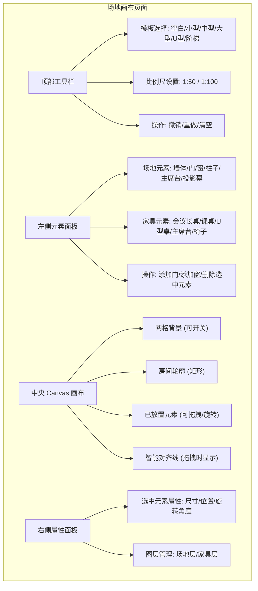
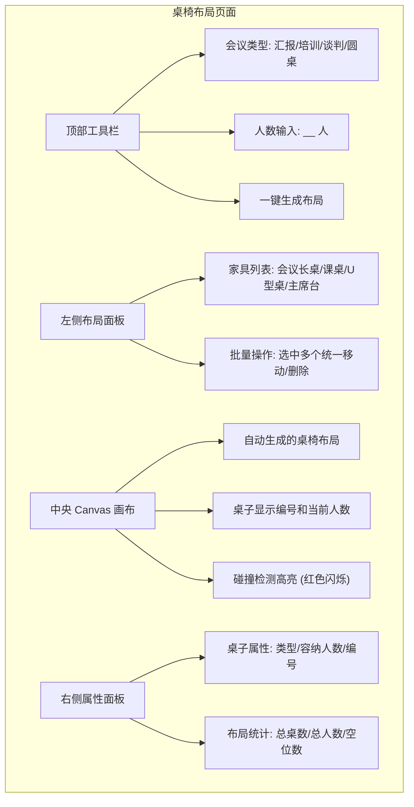
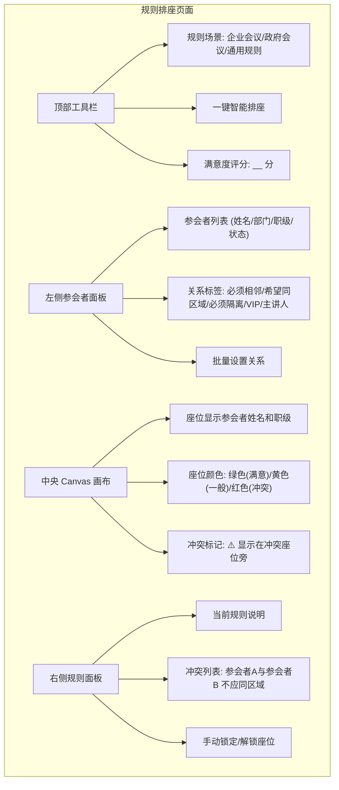
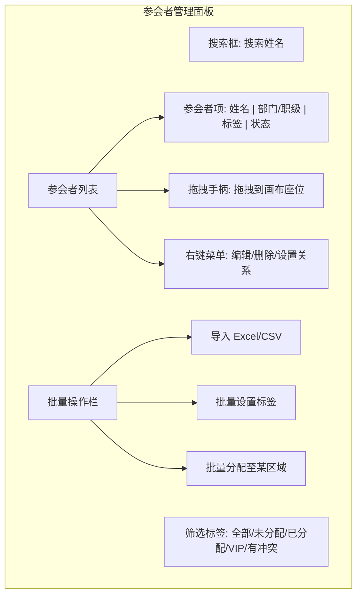
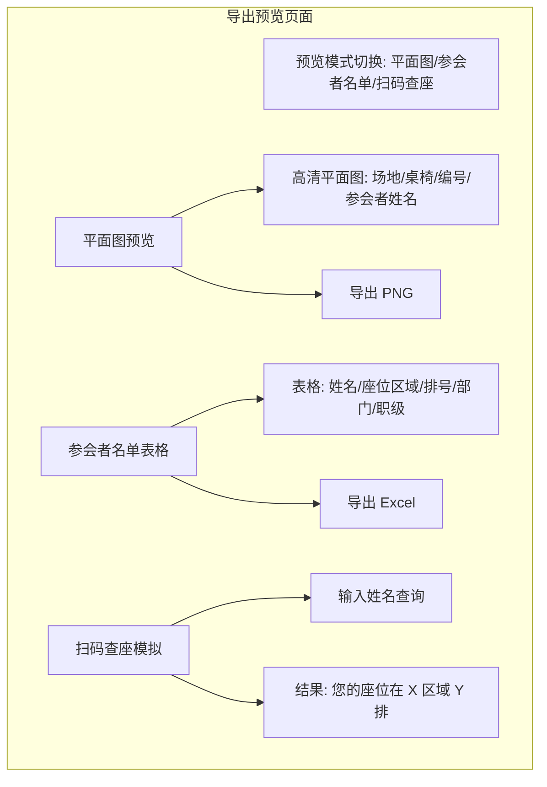
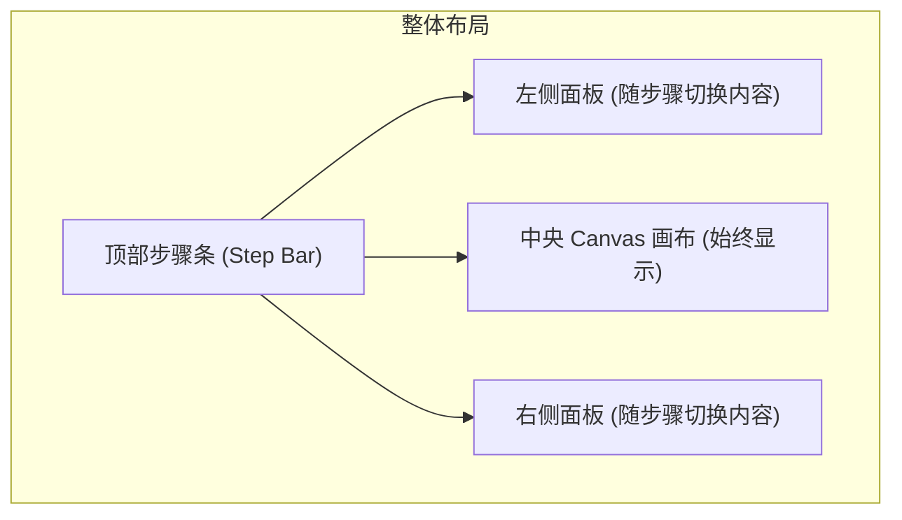
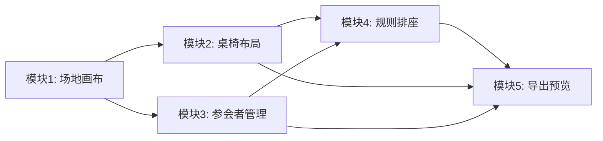

# 智座 Demo 需求文档

> 日期：2026-07-12
> 版本：Demo PRD v2.0
> 目标：演示「场地模拟 → 智能布局 → 规则排座 → 导出预览」核心闭环（会议室场景）

---

## 一、需求背景

报名 Trae 中国社区创造力大赛后，需要一个可交互的网页端 Demo，向评委和潜在用户直观展示「智能座位排布应用」的核心差异化能力。Demo 不是完整产品，但必须完整跑通「场地模拟 → 智能布局 → 规则排座 → 导出预览」的最小闭环，让观看者在 3 分钟内理解产品价值。

---

## 二、目标与范围

**核心目标：**

- 证明「中国座次规则引擎」的技术可行性和体验优势
- 展示 Konva.js + React 实现复杂 Canvas 交互的工程能力
- 提供可直接部署的静态网页，主办方支持一键托管

**Demo 范围（四个模块）：**

| 模块 | 核心演示点 | 必须包含 |
|------|-----------|---------|
| 场地平面图模拟 | 空白画布、预设模板、比例尺、拖拽放置桌椅 | ✅ |
| 智能桌椅布局 | 输入人数自动推荐布局、手动拖拽调整、碰撞检测 | ✅ |
| 规则驱动自动排座 | 企业/政府会议规则、关系标签、一键排座、满意度可视化 | ✅ |
| 导出与预览 | 平面图预览、参会者名单表格、模拟扫码查座 | ✅ |

**不在 Demo 范围内：**

- 用户注册 / 登录
- 后端服务 / 数据库（数据存在 localStorage 或内存）
- AI 平面图导入
- 多人实时协作
- 复杂 RSVP 管理

---

## 三、用户与场景

**演示场景：**

行政小李要为公司季度经营分析会安排座位。会议室长 15 米、宽 10 米，预计参会 40 人，包含公司高管、各部门负责人和外部嘉宾。小李打开网页，选择"中型会议室"模板，系统自动生成主席台和听众席布局。他导入参会名单，标记"VP 必须坐第一排""财务部三人希望相邻""两位竞争对手必须隔离"，点击"智能排座"，3 秒后看到按职级排序的完整座位方案。最后导出平面图和参会名单发给前台。

---

## 四、功能需求

### 4.1 功能总览

| # | 模块 | 功能描述 |
|---|------|---------|
| 1 | 场地画布 | 支持空白画布和预设模板（小型/中型/大型会议室、U型会议、阶梯教室）。用户输入房间长宽（米），生成按比例缩放的 Canvas 画布。提供墙体、门、窗、柱子、主席台、投影幕等基础元素的拖拽放置；支持双击元素锁定/解锁，锁定后显示半透明小锁图标。画布支持网格吸附和智能对齐线。 |
| 2 | 桌椅布局 | 用户输入参与人数和会议类型（汇报/培训/谈判/圆桌），系统根据会议室标准自动计算桌椅数量和类型，并在画布内合理摆放。支持手动拖拽桌子调整位置、旋转（0-360°），拖拽时实时碰撞检测。 |
| 3 | 规则排座 | 内建企业会议规则（职级排序、部门聚类、特殊嘉宾安排）和政府会议规则（左为上、职务排序、主客方位）。用户可为参会者设置关系标签："必须相邻""希望同区域""必须隔离""VIP""主讲人"。基于规则引擎自动分配座位，3 秒内输出无冲突方案。排座结果以颜色标注满意度（绿色=满意、黄色=一般、红色=冲突），提供冲突列表。支持手动锁定特定座位。 |
| 4 | 参会者管理 | 支持从 Excel/CSV 导入参会者名单（姓名、电话、部门、职级、关系标签）。侧边栏显示参会者列表，支持搜索、筛选（未分配/已分配/VIP/有冲突）。支持拖拽参会者到座位入座。 |
| 5 | 导出预览 | 提供"平面图预览模式"：隐藏编辑辅助线，显示完整场地轮廓、桌椅位置、桌号、参会者姓名。支持导出为 PNG 图片。提供"参会者名单表格"：姓名、座位区域/排号、职级。提供"模拟扫码查座"：输入姓名显示座位位置。 |

### 4.2 模块一：场地画布（含技术实现细节）

**原型图**



#### 4.2.1 坐标系与比例尺转换（核心技术点）

场地模拟的第一个技术难点在于**真实世界坐标（米）与 Canvas 像素坐标的无损映射**。必须保证用户在画布上拖拽移动 10 像素，对应真实场地中精确移动 0.5 米（假设比例尺 1:50），且导出打印时不失真。

**坐标转换公式：**

```typescript
// 核心常量：画布在屏幕上的像素尺寸
const CANVAS_WIDTH_PX = 1000;  // 画布固定显示为 1000px 宽
const CANVAS_HEIGHT_PX = 800;  // 根据房间宽高比自适应

// 比例尺定义：1:50 表示 1 米 = 50 像素
const SCALE = 50; // pixels per meter

// 米 → 像素（渲染时使用）
function metersToPixels(meters: number): number {
  return meters * SCALE;
}

// 像素 → 米（保存/导出时使用）
function pixelsToMeters(px: number): number {
  return px / SCALE;
}

// 房间尺寸映射示例：15m × 10m 会议室
const roomWidthM = 15;
const roomHeightM = 10;
const canvasWidthPx = metersToPixels(roomWidthM);  // 750px
const canvasHeightPx = metersToPixels(roomHeightM); // 500px
```

**缩放/平移下的坐标转换：**

画布支持缩放（`stageScale`）和平移（`stagePos`）后，Konva 事件返回的坐标是 Stage 内部坐标，需补偿缩放和平移才能还原为真实米坐标。

```typescript
// 拖拽结束时，将 Konva 坐标转换为真实米坐标
function konvaToMeters(
  konvaX: number,
  konvaY: number,
  stageScale: number,
  stagePos: { x: number; y: number }
): { x: number; y: number } {
  // 1. 减去 Stage 平移偏移
  // 2. 除以 Stage 缩放比例
  // 3. 转换为米
  const realPx_x = (konvaX - stagePos.x) / stageScale;
  const realPx_y = (konvaY - stagePos.y) / stageScale;
  return {
    x: pixelsToMeters(realPx_x),
    y: pixelsToMeters(realPx_y),
  };
}

// 反向：米坐标 → Konva 坐标（渲染时使用）
function metersToKonva(
  metersX: number,
  metersY: number,
  stageScale: number,
  stagePos: { x: number; y: number }
): { x: number; y: number } {
  const px_x = metersToPixels(metersX);
  const px_y = metersToPixels(metersY);
  return {
    x: px_x * stageScale + stagePos.x,
    y: px_y * stageScale + stagePos.y,
  };
}

// 使用示例：拖拽结束
function handleDragEnd(e: KonvaEventObject<DragEvent>) {
  const { x, y } = konvaToMeters(
    e.target.x(),
    e.target.y(),
    stageScale,
    stagePos
  );
  updateElement(element.id, { x, y });
}
```

**关键规则：** Store 中所有坐标始终以米为单位存储，缩放/平移参数仅影响渲染层，不污染数据层。

**实现约束：**

- Canvas 外容器固定 `width: 1000px`，内部 Konva `Stage` 根据房间比例自适应高度
- 所有元素在 Store 中以**米为单位**存储（`x: 3.5` 表示距左墙 3.5 米），仅在渲染时转换为像素
- 拖拽结束时，将 Konva 返回的像素坐标转换回米存入状态
- 比例尺切换时（如从 1:50 切到 1:100），所有元素的米坐标不变，仅渲染像素值变化

#### 4.2.2 房间轮廓绘制方案

会议室房间以**矩形轮廓**为基准，墙体作为独立元素叠加在轮廓上。

**方案对比：**

| 方案 | 实现方式 | 优点 | 缺点 | Demo 选用 |
|------|---------|------|------|----------|
| A. 轮廓线 | 四根 Line 组成矩形 | 简单，边界清晰 | 无"房间内部"概念，元素拖拽越界检测需单独计算 | ❌ |
| B. 填充矩形 + 边框 | 一个 Rect 填充白色，stroke 描边 | 有内部区域，越界检测可用 Konva hitFunc | 不支持 L 型等不规则房间 | ✅ |
| C. 多边形路径 | Path 绘制任意形状 | 支持不规则房间 | 实现复杂，Demo 阶段 ROI 低 | ❌ |

**Demo 采用方案 B（填充矩形 + 边框）：**

```tsx
// Konva 实现
<Rect
  x={0}
  y={0}
  width={metersToPixels(venue.width)}
  height={metersToPixels(venue.height)}
  fill="#fafafa"
  stroke="#333"
  strokeWidth={4}
  // 禁止拖拽房间本身
  draggable={false}
/>
```

**越界检测逻辑：**

```typescript
function isInsideVenue(xMeters: number, yMeters: number, venue: Venue): boolean {
  const margin = 0.2; // 离墙至少 0.2 米
  return (
    xMeters >= margin &&
    xMeters <= venue.width - margin &&
    yMeters >= margin &&
    yMeters <= venue.height - margin
  );
}

// 拖拽约束：元素移动时实时检测
function constrainToVenue(newX: number, newY: number, elementWidth: number, elementHeight: number, venue: Venue) {
  const margin = 0.2;
  return {
    x: Math.max(margin, Math.min(newX, venue.width - elementWidth - margin)),
    y: Math.max(margin, Math.min(newY, venue.height - elementHeight - margin)),
  };
}
```

#### 4.2.3 墙体与场地元素绘制

Demo 中墙体以**独立矩形块**表示，每块墙体是一个可拖拽、可调整尺寸的 `VenueElement`。

**墙体绘制（Konva Rect）：**

```tsx
<Rect
  x={metersToPixels(element.x)}
  y={metersToPixels(element.y)}
  width={metersToPixels(element.width)}
  height={metersToPixels(element.height)}
  fill="#bdbdbd"
  stroke="#616161"
  strokeWidth={1}
  draggable
  onDragMove={(e) => {
    // 实时约束在房间内
    const pos = e.target.position();
    const constrained = constrainToVenue(
      pixelsToMeters(pos.x),
      pixelsToMeters(pos.y),
      element.width,
      element.height,
      venue
    );
    e.target.position({
      x: metersToPixels(constrained.x),
      y: metersToPixels(constrained.y),
    });
  }}
  onDragEnd={(e) => {
    updateElement(element.id, {
      x: pixelsToMeters(e.target.x()),
      y: pixelsToMeters(e.target.y()),
    });
  }}
/>
```

**元素类型与默认尺寸（米）：**

| 元素 | 默认宽(m) | 默认高(m) | 颜色 | 层级 | 默认锁定 |
|------|----------|----------|------|------|---------|
| 墙体 | 3.0 | 0.15 | #bdbdbd | 场地层 | ✅ |
| 门 | 1.2 | 0.15 | #a5d6a7 | 场地层 | ❌ |
| 窗 | 2.0 | 0.15 | #90caf9 | 场地层 | ❌ |
| 柱子 | 0.4 | 0.4 | #757575 | 场地层 | ✅ |
| 主席台 | 4.0 | 1.0 | #ffcc80 | 场地层 | ❌ |
| 投影幕 | 2.5 | 0.05 | #b3e5fc | 场地层 | ❌ |

**门/窗/壁挂屏幕的增减交互（墙挂模式）：**

门、窗、壁挂屏幕等依附于墙体的元素，采用**墙挂模式**进行增删，避免左侧面板操作与画布拖拽之间的上下文切换。

**添加流程：**

1. 鼠标悬浮在墙体上超过 **0.5 秒** → 墙体中央出现悬浮加号（`+`，圆形半透明按钮，直径 24px）
2. 点击加号 → 加号展开为三个图标（门、窗、屏），沿墙体法线方向（垂直于墙体向外）排列
3. 用户鼠标按下并拖拽其中一个图标 → 图标跟随鼠标，接近墙体时显示预览轮廓
4. 在目标位置释放 → 该元素被添加到墙体上，元素进入**突出显示状态**（高亮边框 + 轻微放大 1.05 倍，持续 0.3 秒）
5. 新添加的元素默认**不锁定**，位置沿墙体边缘自动吸附

**删除流程：**

1. 鼠标悬浮在已挂在墙上的元素（门/窗/屏幕）上超过 **0.5 秒** → 元素右上角出现悬浮减号（`−`，圆形红色半透明按钮，直径 20px）
2. 点击减号 → 元素进入**突出显示状态**（红色边框闪烁一次）
3. 再次点击该元素（或按 Delete 键）→ 元素消失，墙体恢复原状

**Konva 实现要点：**

```tsx
// 墙体悬浮检测：使用 Konva 的 onMouseEnter + setTimeout
<Rect
  onMouseEnter={() => {
    wallHoverTimer = setTimeout(() => setShowAddButton(true), 500);
  }}
  onMouseLeave={() => {
    clearTimeout(wallHoverTimer);
    setShowAddButton(false);
    setShowAttachmentMenu(false);
  }}
/>

// 加号按钮（悬浮在墙体中央）
{showAddButton && !showAttachmentMenu && (
  <Group x={wallCenterX} y={wallCenterY}>
    <Circle radius={12} fill="#1976d2" opacity={0.9} />
    <Text text="+" fontSize={16} fill="white" x={-5} y={-7} />
    {/* 点击后展开为三个图标 */}
    <Group onClick={() => setShowAttachmentMenu(true)}>
      <Circle radius={14} fill="transparent" /> {/* 扩大点击区域 */}
    </Group>
  </Group>
)}

// 展开的三个图标（门、窗、屏），使用自定义 SVG 线框图标
{showAttachmentMenu && (
  <Group>
    {/* 门图标，沿墙体法线方向偏移 */}
    <DraggableAttachment type="door" svgUrl={doorIconUrl} offset={{ x: 0, y: -32 }} />
    {/* 窗图标 */}
    <DraggableAttachment type="window" svgUrl={windowIconUrl} offset={{ x: 0, y: 0 }} />
    {/* 壁挂屏幕图标 */}
    <DraggableAttachment type="screen" svgUrl={screenIconUrl} offset={{ x: 0, y: 32 }} />
  </Group>
)}

// 已挂载元素的减号按钮
<Group
  onMouseEnter={() => {
    elementHoverTimer = setTimeout(() => setShowRemoveButton(true), 500);
  }}
  onMouseLeave={() => {
    clearTimeout(elementHoverTimer);
    setShowRemoveButton(false);
  }}
>
  <Rect {...elementProps} />
  {showRemoveButton && (
    <Group x={element.width - 12} y={-10}>
      <Circle radius={10} fill="#f44336" opacity={0.9} />
      <Text text="−" fontSize={14} fill="white" x={-4} y={-6} />
    </Group>
  )}
</Group>
```

**图标方案说明：**

三个展开图标采用**自定义 SVG 无填充线框图标**，统一风格为 1.8px 描边、圆角线帽、蓝色 `#1976d2`，存放于 `src/assets/icons/` 目录：

| 元素 | SVG 文件 | 视觉描述 |
|------|---------|---------|
| 门 | `door-icon.svg` | 竖向矩形门框 + 右侧门把手（小圆点） |
| 窗 | `window-icon.svg` | 正方形窗框 + 十字窗棂分割 |
| 屏 | `screen-icon.svg` | 横向矩形显示器 + 底部支架 |

图标在 Konva 中通过 `Path` 或 `Image`（加载 SVG 后渲染）显示，统一为 24×24px，外裹圆形按钮（直径 28px，白色背景 + 蓝色边框），下方不再标注文字标签。

**React 加载 SVG 的方式：**

```typescript
// 方式一：Vite 的 SVG 导入（推荐）
import doorIconUrl from '../../assets/icons/door-icon.svg';
import windowIconUrl from '../../assets/icons/window-icon.svg';
import screenIconUrl from '../../assets/icons/screen-icon.svg';

// 在 Konva 中通过 Image 加载
function useSvgImage(url: string) {
  const [image, setImage] = useState<HTMLImageElement | null>(null);
  useEffect(() => {
    const img = new Image();
    img.onload = () => setImage(img);
    img.src = url;
  }, [url]);
  return image;
}

// 渲染为 Konva Image
const doorImg = useSvgImage(doorIconUrl);
<KonvaImage image={doorImg} width={24} height={24} x={-12} y={-12} />
```

**替换说明：** 如果后续在 iconfont.cn 上找到更合适的图标，只需下载 SVG 文件替换 `src/assets/icons/` 下对应文件即可，代码无需改动。

**交互细节：**

- 悬浮加号/减号出现时，如果鼠标在 0.5 秒内移开，则不显示（避免误触）
- 展开的三个图标在 3 秒内无操作则自动收回
- 新添加的元素自动吸附到墙体边缘（门/窗的某一边与墙体对齐）
- 删除确认机制：第一次点击减号仅进入突出显示状态（给用户反悔时间），第二次点击才执行删除

#### 4.2.4 元素锁定与解锁机制

为避免拖动桌椅后意外触发碰撞检测导致已固定的屏幕、主席台等被移动，每个元素支持独立的锁定状态。为保持界面简洁，锁图标采用**按需浮现**策略，平时不显示，仅在用户有意交互时才出现。

**交互规则：**

- **鼠标悬浮在元素上超过 0.5 秒** → 元素右上角浮现小锁图标，显示持续 **1.5 秒**
- 锁图标显示期间，**点击图标** → 切换锁定/解锁状态
- **锁定后**：元素不可拖拽、不可被碰撞检测被动移动、不参与自动布局的重排，元素整体颜色变暗（`brightness: 0.85`）
- **解锁后**：恢复可拖拽状态和正常颜色
- **批量锁定**：支持框选多个元素后，点击工具栏"锁定/解锁"按钮批量切换

**视觉反馈：**

| 状态 | 元素外观 | 锁图标 |
|------|---------|--------|
| 未锁定（平时） | 正常颜色 | **不显示** |
| 未锁定（悬浮 0.5s 后） | 正常颜色 | 右上角浮现半透明锁图标（`opacity: 0.7`），持续 1.5s |
| 已锁定（平时） | 颜色变暗（`brightness: 0.85`） | **不显示** |
| 已锁定（悬浮 0.5s 后） | 颜色变暗 | 右上角浮现锁图标（实心 🔒），持续 1.5s |

**Konva 实现：**

```tsx
function LockableElement({ element }: { element: VenueElement | Table }) {
  const [showLockIcon, setShowLockIcon] = useState(false);
  const hoverTimerRef = useRef<NodeJS.Timeout | null>(null);
  const hideTimerRef = useRef<NodeJS.Timeout | null>(null);

  const handleMouseEnter = () => {
    // 悬浮 0.5 秒后显示锁图标
    hoverTimerRef.current = setTimeout(() => {
      setShowLockIcon(true);
      // 1.5 秒后自动隐藏
      hideTimerRef.current = setTimeout(() => {
        setShowLockIcon(false);
      }, 1500);
    }, 500);
  };

  const handleMouseLeave = () => {
    // 移开时清除悬浮计时器
    if (hoverTimerRef.current) {
      clearTimeout(hoverTimerRef.current);
    }
    // 注意：不移除 hideTimer，让图标自然消失，避免闪烁
  };

  const handleLockClick = (e: any) => {
    e.cancelBubble = true; // 阻止冒泡，避免触发元素选中
    toggleLock(element.id);
    // 切换后立即隐藏图标
    setShowLockIcon(false);
    if (hideTimerRef.current) clearTimeout(hideTimerRef.current);
  };

  return (
    <Group
      onMouseEnter={handleMouseEnter}
      onMouseLeave={handleMouseLeave}
      opacity={element.locked ? 0.85 : 1}
      draggable={!element.locked}
    >
      {/* 元素主体 */}
      <Rect {...elementProps} />

      {/* 锁图标（仅悬浮后显示） */}
      {showLockIcon && (
        <Group
          x={element.width - 20}
          y={2}
          onClick={handleLockClick}
          onTap={handleLockClick}
        >
          <Rect width={18} height={18} fill="white" opacity={0.9} cornerRadius={3} />
          <Text
            text={element.locked ? '🔒' : '🔓'}
            fontSize={12}
            x={2}
            y={-1}
          />
        </Group>
      )}
    </Group>
  );
}
```

**交互细节：**

- 悬浮计时器（0.5s）在鼠标移开时立即清除，避免误触
- 隐藏计时器（1.5s）在鼠标移开后继续运行，保证图标自然消失
- 点击锁图标时阻止事件冒泡，避免同时触发元素选中
- 锁定状态切换后，图标立即消失，用户可通过元素颜色变暗感知状态变化
- 批量锁定通过工具栏操作，不依赖悬浮交互

**碰撞检测中的锁定保护：**

```typescript
function resolveCollision(
  movedElement: VenueElement | Table,
  allElements: Array<VenueElement | Table>
): Position {
  for (const other of allElements) {
    if (other.id === movedElement.id) continue;

    if (checkCollision(movedElement, other)) {
      // 如果对方已锁定，只能移动当前元素
      if (other.locked) {
        return pushAway(movedElement, other);
      }
      // 如果当前元素已锁定，不允许移动（用户应解锁后再调整）
      if (movedElement.locked) {
        return { x: movedElement.x, y: movedElement.y };
      }
      // 双方都未锁定时，仅移动当前拖拽的元素
      return pushAway(movedElement, other);
    }
  }
  return { x: movedElement.x, y: movedElement.y };
}
```

#### 4.2.5 网格吸附算法

网格吸附是场地精确排布的关键，避免手工拖拽导致的像素级偏差。

**算法实现：**

```typescript
const GRID_SIZE_METERS = 0.5; // 网格间距 0.5 米

function snapToGrid(value: number, gridSize: number = GRID_SIZE_METERS): number {
  return Math.round(value / gridSize) * gridSize;
}

// 拖拽结束时的吸附处理
function onDragEndSnap(e: KonvaEventObject<DragEvent>, element: VenueElement | Table) {
  const rawX = pixelsToMeters(e.target.x());
  const rawY = pixelsToMeters(e.target.y());

  const snappedX = snapToGrid(rawX);
  const snappedY = snapToGrid(rawY);

  // 吸附后仍需要约束在房间内
  const constrained = constrainToVenue(snappedX, snappedY, element.width, element.height, venue);

  updateElement(element.id, { x: constrained.x, y: constrained.y });
}
```

**交互细节：**

- 网格显示为浅灰色虚线，间距固定 0.5 米（可在 UI 切换为 1 米）
- 吸附为"软吸附"：当元素中心距离网格线小于 0.15 米时自动吸附，否则保持原位置
- 吸附优先级：网格吸附 > 智能对齐线（见 4.2.6）

#### 4.2.6 智能对齐线（Smart Snap Lines）

当拖拽元素时，如果该元素的中心线或边缘线与另一个元素的中心线/边缘线接近（差值 < 0.2 米），显示对齐辅助线并自动吸附。

**对齐规则：**

```typescript
interface SnapLine {
  position: number; // 米为单位
  orientation: 'horizontal' | 'vertical';
}

function getSnapLines(elements: Array<VenueElement | Table>, excludeId: string): SnapLine[] {
  const lines: SnapLine[] = [];

  for (const el of elements) {
    if (el.id === excludeId) continue;
    // 左边缘
    lines.push({ position: el.x, orientation: 'vertical' });
    // 右边缘
    lines.push({ position: el.x + el.width, orientation: 'vertical' });
    // 水平中心
    lines.push({ position: el.x + el.width / 2, orientation: 'vertical' });
    // 上边缘
    lines.push({ position: el.y, orientation: 'horizontal' });
    // 下边缘
    lines.push({ position: el.y + el.height, orientation: 'horizontal' });
    // 垂直中心
    lines.push({ position: el.y + el.height / 2, orientation: 'horizontal' });
  }

  return lines;
}

function findNearestSnapLine(
  value: number,
  lines: SnapLine[],
  orientation: 'horizontal' | 'vertical',
  threshold: number = 0.2
): number | null {
  const matching = lines.filter((l) => l.orientation === orientation);
  let nearest: number | null = null;
  let minDiff = threshold;

  for (const line of matching) {
    const diff = Math.abs(value - line.position);
    if (diff < minDiff) {
      minDiff = diff;
      nearest = line.position;
    }
  }

  return nearest;
}
```

**渲染对齐线（Konva Line）：**

```tsx
// 在独立 Layer 中渲染对齐线
<Layer name="snap-lines">
  {activeSnapLines.map((line, i) => (
    line.orientation === 'vertical' ? (
      <Line
        key={`v-${i}`}
        points={[metersToPixels(line.position), 0, metersToPixels(line.position), canvasHeightPx]}
        stroke="#1976d2"
        strokeWidth={1}
        dash={[5, 5]}
        opacity={0.8}
      />
    ) : (
      <Line
        key={`h-${i}`}
        points={[0, metersToPixels(line.position), canvasWidthPx, metersToPixels(line.position)]}
        stroke="#1976d2"
        strokeWidth={1}
        dash={[5, 5]}
        opacity={0.8}
      />
    )
  ))}
</Layer>
```

#### 4.2.7 图层管理（场地层 / 家具层）

Konva 通过多个 `Layer` 实现图层分离，保证场地结构（墙体/柱子）始终位于家具（桌椅）下方。

**图层结构：**

```tsx
<Stage>
  {/* 第 1 层：网格背景（最底层） */}
  <Layer name="grid">
    <Rect width={canvasWidth} height={canvasHeight} fill="#fafafa" />
    {gridLines.map(...)}
  </Layer>

  {/* 第 2 层：场地结构层（墙体/柱子/主席台/投影幕） */}
  <Layer name="venue">
    <Rect width={canvasWidth} height={canvasHeight} fill="white" stroke="#333" strokeWidth={4} />
    {venue.elements.map((el) => <VenueShape key={el.id} element={el} />)}
  </Layer>

  {/* 第 3 层：家具层（桌椅/参会者） */}
  <Layer name="furniture">
    {venue.tables.map((table) => <TableShape key={table.id} table={table} />)}
  </Layer>

  {/* 第 4 层：交互辅助层（对齐线/选择框/拖拽预览） */}
  <Layer name="overlay">
    {snapLines.map(...)}
    {selectionBox && <Rect {...selectionBox} stroke="#1976d2" dash={[4, 4]} />}
  </Layer>
</Stage>
```

**图层锁定：**

- 场地层默认锁定（不可拖拽），需在属性面板手动解锁
- 家具层始终可拖拽
- 图层锁定通过设置 `draggable={false}` 实现，而非视觉隐藏

#### 4.2.8 比例尺动态切换

```typescript
const SCALES = [25, 50, 100]; // 1:25, 1:50, 1:100

// 切换比例尺时，仅更新渲染参数，不修改元素的米坐标
function setScale(newScale: number) {
  setStore({ scale: newScale });
  // Konva Stage 的 width/height 会重新计算
  // 所有元素的 x/y/width/height 在渲染时自动使用新的 scale 转换
}
```

---

### 4.3 模块二：桌椅布局

**原型图**



#### 4.3.1 桌椅领域空间与虚拟点位（核心技术方案）

会议室场景中，桌子和椅子采用**半绑定模式**：每张桌子拥有独立的"领域空间"，空间内包含一组虚拟座位点位（`SeatSlot`）。椅子默认绑定在桌子的点位上，跟随桌子一起移动；用户也可双击某把椅子将其解绑为自由元素，单独调整位置。

**领域空间定义：**

```typescript
// 虚拟座位点位（相对于桌子中心的本地坐标）
interface SeatSlot {
  id: string;
  localX: number; // 相对于桌子中心的 X 偏移（米）
  localY: number; // 相对于桌子中心的 Y 偏移（米）
  angle: number;   // 椅子朝向角度（度），0 表示朝上
  occupantId?: string; // 当前占用该点位的参会者 ID
}

// 会议桌的领域空间
interface Table {
  id: string;
  type: 'conference-long' | 'training-desk' | 'u-shape' | 'round' | 'head';
  x: number;
  y: number;
  rotation: number;
  width: number;      // 桌子宽度（米）
  height: number;     // 桌子高度（米）
  tableNumber: string;
  capacity: number;   // 最大可容纳椅子数
  seatSlots: SeatSlot[]; // 虚拟座位点位，由动态算法生成
}
```

**动态点位计算算法：**

每把椅子在场景中占据固定空间 **0.5m × 0.5m**，椅子之间最小间距 **0.1m**。根据桌子的当前尺寸和椅子数量，系统动态计算均匀分布的点位。

```typescript
const CHAIR_SIZE = 0.5;   // 每把椅子占地 0.5m × 0.5m
const CHAIR_GAP = 0.1;    // 椅子之间最小间距

function calculateSeatSlots(
  tableWidth: number,
  tableHeight: number,
  tableType: TableType,
  chairCount: number
): SeatSlot[] {
  const slots: SeatSlot[] = [];

  if (tableType === 'conference-long' || tableType === 'training-desk') {
    // 长桌：沿桌子四边均匀分布
    // 长边可用长度 = 桌子长 - 两端各留 0.25m
    const longSideLen = Math.max(0, tableWidth - 0.5);
    // 短边可用长度 = 桌子宽 - 两端各留 0.25m
    const shortSideLen = Math.max(0, tableHeight - 0.5);

    // 每边可容纳的椅子数（动态计算）
    const maxLong = Math.floor(longSideLen / (CHAIR_SIZE + CHAIR_GAP));
    const maxShort = Math.floor(shortSideLen / (CHAIR_SIZE + CHAIR_GAP));
    const maxCapacity = maxLong * 2 + maxShort * 2;

    // 实际使用的椅子数不能超过容量
    const actualCount = Math.min(chairCount, maxCapacity);

    // 沿四边均匀分布 actualCount 把椅子
    // 策略：优先长边，其次短边
    const longCount = Math.min(actualCount, maxLong * 2);
    const remaining = actualCount - longCount;
    const shortCount = Math.min(remaining, maxShort * 2);

    // 上长边
    const topCount = Math.ceil(longCount / 2);
    for (let i = 0; i < topCount; i++) {
      const t = topCount > 1 ? i / (topCount - 1) : 0.5;
      slots.push({
        id: `slot-${i}`,
        localX: -tableWidth / 2 + 0.25 + t * longSideLen,
        localY: -tableHeight / 2 - CHAIR_SIZE / 2,
        angle: 0,
      });
    }

    // 下长边
    const bottomCount = longCount - topCount;
    for (let i = 0; i < bottomCount; i++) {
      const t = bottomCount > 1 ? i / (bottomCount - 1) : 0.5;
      slots.push({
        id: `slot-${topCount + i}`,
        localX: -tableWidth / 2 + 0.25 + t * longSideLen,
        localY: tableHeight / 2 + CHAIR_SIZE / 2,
        angle: 180,
      });
    }

    // 左短边
    const leftCount = Math.ceil(shortCount / 2);
    for (let i = 0; i < leftCount; i++) {
      const t = leftCount > 1 ? i / (leftCount - 1) : 0.5;
      slots.push({
        id: `slot-${topCount + bottomCount + i}`,
        localX: -tableWidth / 2 - CHAIR_SIZE / 2,
        localY: -tableHeight / 2 + 0.25 + t * shortSideLen,
        angle: 90,
      });
    }

    // 右短边
    const rightCount = shortCount - leftCount;
    for (let i = 0; i < rightCount; i++) {
      const t = rightCount > 1 ? i / (rightCount - 1) : 0.5;
      slots.push({
        id: `slot-${topCount + bottomCount + leftCount + i}`,
        localX: tableWidth / 2 + CHAIR_SIZE / 2,
        localY: -tableHeight / 2 + 0.25 + t * shortSideLen,
        angle: 270,
      });
    }
  }

  if (tableType === 'round') {
    // 圆桌：沿圆周均匀分布
    const radius = tableWidth / 2 + CHAIR_SIZE / 2;
    const maxCapacity = Math.floor((Math.PI * tableWidth) / (CHAIR_SIZE + CHAIR_GAP));
    const actualCount = Math.min(chairCount, maxCapacity);

    for (let i = 0; i < actualCount; i++) {
      const angle = (i / actualCount) * Math.PI * 2;
      slots.push({
        id: `slot-${i}`,
        localX: Math.cos(angle) * radius,
        localY: Math.sin(angle) * radius,
        angle: (angle * 180) / Math.PI,
      });
    }
  }

  if (tableType === 'u-shape') {
    // U型桌：椅子沿 U 型内侧均匀分布
    // U型底部朝向屏幕/讲台/入口（上方），开口朝向观众席（下方）
    // 结构：底部横条（宽 tableWidth，深 armDepth）+ 左右两翼（深 armDepth）
    const armDepth = 0.6; // 每段桌子的深度

    // 内侧可用边长
    const bottomInnerLen = Math.max(0, tableWidth - 2 * armDepth);
    const leftInnerLen = Math.max(0, tableHeight - armDepth);
    const rightInnerLen = leftInnerLen;
    const totalInnerLen = bottomInnerLen + leftInnerLen + rightInnerLen;

    const maxCapacity = Math.floor(totalInnerLen / (CHAIR_SIZE + CHAIR_GAP));
    const actualCount = Math.min(chairCount, maxCapacity);

    // 按边长比例分配椅子数量
    const bottomCount = Math.round((actualCount * bottomInnerLen) / totalInnerLen);
    const sideCount = actualCount - bottomCount;
    const leftCount = Math.ceil(sideCount / 2);
    const rightCount = sideCount - leftCount;

    let slotIdx = 0;

    // 底部内侧（U型封闭端，面向屏幕/讲台）
    // y = -tableHeight/2 + armDepth/2 为底部内侧中心线
    for (let i = 0; i < bottomCount; i++) {
      const t = bottomCount > 1 ? i / (bottomCount - 1) : 0.5;
      slots.push({
        id: `slot-${slotIdx++}`,
        localX: -bottomInnerLen / 2 + t * bottomInnerLen,
        localY: -tableHeight / 2 + armDepth / 2 - CHAIR_SIZE / 2,
        angle: 0, // 朝上，面向底部（屏幕/讲台方向）
      });
    }

    // 左翼内侧
    for (let i = 0; i < leftCount; i++) {
      const t = leftCount > 1 ? i / (leftCount - 1) : 0.5;
      slots.push({
        id: `slot-${slotIdx++}`,
        localX: -tableWidth / 2 + armDepth / 2 - CHAIR_SIZE / 2,
        localY: -leftInnerLen / 2 + t * leftInnerLen,
        angle: 90, // 朝右，面向U型中心
      });
    }

    // 右翼内侧
    for (let i = 0; i < rightCount; i++) {
      const t = rightCount > 1 ? i / (rightCount - 1) : 0.5;
      slots.push({
        id: `slot-${slotIdx++}`,
        localX: tableWidth / 2 - armDepth / 2 + CHAIR_SIZE / 2,
        localY: -rightInnerLen / 2 + t * rightInnerLen,
        angle: 270, // 朝左，面向U型中心
      });
    }
  }

  if (tableType === 'head') {
    // 主席台：仅在一侧放椅子（面向观众席的一侧）
    // 默认 rotation=0 时，主席台水平放置，椅子放在下侧（y 正方向）
    const availableLen = Math.max(0, tableWidth - 0.5);
    const maxCapacity = Math.floor(availableLen / (CHAIR_SIZE + CHAIR_GAP));
    const actualCount = Math.min(chairCount, maxCapacity);

    for (let i = 0; i < actualCount; i++) {
      const t = actualCount > 1 ? i / (actualCount - 1) : 0.5;
      slots.push({
        id: `slot-${i}`,
        localX: -tableWidth / 2 + 0.25 + t * availableLen,
        localY: tableHeight / 2 + CHAIR_SIZE / 2,
        angle: 180, // 朝下，面向观众席
      });
    }
  }

  return slots;
}

// 将本地坐标转换为画布全局坐标
function slotToGlobal(slot: SeatSlot, table: Table): { x: number; y: number; angle: number } {
  const cos = Math.cos((table.rotation * Math.PI) / 180);
  const sin = Math.sin((table.rotation * Math.PI) / 180);

  return {
    x: table.x + (slot.localX * cos - slot.localY * sin),
    y: table.y + (slot.localX * sin + slot.localY * cos),
    angle: slot.angle + table.rotation,
  };
}
```

**关键规则：**

- 桌子长宽用户可在属性面板调整，调整后端点位自动重新计算
- 椅子数量变化时（增加/减少/解绑），点位重新计算并均匀分布
- 空点位显示为虚线轮廓，已占点位显示为实心椅子图形
- 拖拽桌子时，所有绑定的椅子跟随桌子和点位一起移动
- 双击某把椅子 → 解绑为自由元素，可独立拖拽；再次双击 → 重新绑定到最近的空点位

**业务逻辑：**

- 用户选择会议类型 + 输入人数 → 点击"一键生成布局" → 系统计算所需桌椅数量和类型 → 在画布内合理摆放
- 会议类型与布局策略：
  - **汇报**：主席台贴前墙居中摆放 + 听众席（长桌或课桌面向主席台，按排均匀分布）
  - **培训**：课桌式，每排 4–6 桌，行距 ≥ 1.5m，通道 ≥ 1.2m，从后向前均匀填充
  - **谈判**：主客双方对坐，中间留 ≥ 1.5m 通道，每侧均匀分布
  - **圆桌**：圆桌在房间中央均匀分布，四周留 ≥ 1.2m 通道
- **屏幕贴墙自动居中**：当画布中存在投影幕且其 locked 为 true 时，自动布局以屏幕为视觉中心基准线，对称摆放桌椅；若屏幕未锁定或未放置，则默认以房间水平中线为对称轴
- **均匀分布算法**：自动布局不采用"从左到右堆叠"，而是先计算可用区域，再按行/列均匀分配间距，确保桌子不会扎堆在一侧
- **智能重排策略**：
  - 桌子**已锁定** → 一键布局时只重新计算该桌子的虚拟点位并均匀分布椅子，桌子位置不变
  - 桌子**未锁定** → 桌子 + 椅子一起重新计算最佳位置
- 碰撞检测：桌子之间至少保持 0.8 米通道，桌子距墙至少 0.5 米；**已锁定的元素（如主席台、投影幕）在碰撞检测中视为不可移动的障碍物**
- 桌子自动编号：主席台为"主席台"，听众席为"第 X 排"

**交互逻辑：**

- 输入人数 + 选择会议类型 → 点击"一键生成" → 系统在画布生成布局 → 显示成功提示
- 拖拽已有桌子 → 实时碰撞检测，如果与其他物体重叠 → 显示红色闪烁警告，释放后如果仍重叠 → 自动弹开到最近合法位置；**已锁定的元素不会因碰撞而被弹开**
- 选中桌子 → 显示容纳人数、当前已分配人数、空位数；可在属性面板调整桌子长宽，调整后虚拟点位自动重新计算
- 双击某把椅子 → 解绑/绑定切换；解绑后可独立拖拽，绑定后自动落入最近的空点位

---

### 4.4 模块三：规则排座（核心差异化）

**原型图**



**业务逻辑：**

- 用户选择规则场景（企业/政府/通用）→ 系统加载对应规则库
- 用户为参会者设置关系标签 → 系统记录约束条件
- 点击"一键智能排座" → 系统基于规则引擎自动分配座位 → 3 秒内输出结果
- 评分规则：
  - 关系"必须相邻"的参会者相邻：+20 分
  - 关系"希望同区域"的参会者在同一排/区域：+10 分
  - 关系"必须隔离"的参会者相邻：-40 分
  - 关系"必须隔离"的参会者在同一排：-20 分
  - VIP 参会者安排在前排或主席台附近：+10 分
  - 主讲人安排在主席台正中：+15 分
  - 企业场景：职级未按前后顺序排列（高管在前、普通员工在后）：-10 分
  - 政府场景：违反"左为上"规则：-20 分
  - 部门聚类：同一部门人员分散超过 3 排：-5 分/人
- 最终得分经平滑函数处理，VIP 和主讲人得分权重 ×3
- **评分维度**：按参会者个人评分（非全局评分），每人根据其关系满足情况计算独立得分
- **满意度阈值**：
  - **绿色（满意）**：个人得分 ≥ 10 分
  - **黄色（一般）**：个人得分 -10 ~ 9 分
  - **红色（冲突）**：个人得分 < -10 分，或违反任何硬约束（如与 must-isolate 的人同桌）
- 全局满意度评分 = 所有人平均分，显示在工具栏

**交互逻辑：**

- 选择规则场景 → 右侧显示该场景的规则说明
- 在参会者列表中点击参会者 → 弹出关系设置弹窗 → 选择关系标签和关联参会者 → 保存
- 点击"一键智能排座" → 显示加载动画（"正在计算最优方案..."）→ 3 秒后显示结果
- 排座结果以颜色标注：绿色（非常满意）、黄色（一般）、红色（存在冲突）
- 右侧显示冲突列表，点击冲突项 → 自动定位到对应座位
- 用户可手动拖拽参会者到不同座位 → 实时更新满意度和冲突列表
- 右键点击座位 → 选择"锁定该座位" → 再次智能排座时该座位不变

---

### 4.5 模块四：参会者管理

**原型图**



**业务逻辑：**

- 支持 Excel/CSV 导入，自动识别列：姓名、电话、部门、职级、关系标签
- 参会者状态：未分配（灰色）、已分配（绿色）、VIP（金色）、有冲突（红色）
- 拖拽参会者到座位 → 该参会者状态变为"已分配"，座位显示姓名
- 拖拽参会者到桌子 → 自动分配到该桌的空座位
- 拖拽参会者到画布背景 → 取消分配

**交互逻辑：**

- 点击"导入" → 弹出文件选择 → 解析 Excel/CSV → 显示导入结果 → 参会者列表更新
- 拖拽参会者到画布 → 参会者卡片跟随鼠标 → 接近座位时座位高亮 → 释放后入座
- 点击参会者项 → 展开详情面板（姓名、电话、部门、职级、标签）

---

### 4.6 模块五：导出与预览

**原型图**



**业务逻辑：**

- 平面图预览：隐藏编辑辅助线（网格、对齐线、控制点），显示完整场地轮廓、桌椅位置、编号、参会者姓名
- 参会者名单表格：按座位区域排序，显示姓名、座位区域/排号、部门、职级
- 扫码查座模拟：输入姓名 → 显示座位区域和排号（不暴露全场布局）

**交互逻辑：**

- 点击"预览模式" → 进入只读预览，隐藏所有编辑控件
- 点击"导出 PNG" → 以 Konva `toDataURL({ pixelRatio: 2 })` 生成高清平面图，自动下载
- 点击"导出 Excel" → 生成参会者名单表格，自动下载
- 扫码查座：输入框输入姓名 → 点击查询 → 显示结果卡片（座位区域、排号、在平面图上的高亮位置）

**导出规格：**

| 导出项 | 格式 | 分辨率/尺寸 | 文件名规则 | 内容 |
|--------|------|------------|-----------|------|
| 平面图 | PNG | 画布像素尺寸 × 2（pixelRatio: 2），如画布 1000×750px → 导出 2000×1500px | `会议室座位图_{日期}_{时间}.png` | 场地轮廓、桌椅、编号、参会者姓名，不含网格/对齐线 |
| 参会名单 | Excel (.xlsx) | — | `参会名单_{日期}.xlsx` | 按桌号排序：姓名、桌号、座位号、部门、职级、饮食禁忌 |

---

## 五、数据模型

### 5.1 核心数据结构

```typescript
// 场地
interface Venue {
  id: string;
  name: string;
  width: number; // 米
  height: number; // 米
  scale: number; // 像素/米，如 50 表示 1 米 = 50 像素
  elements: VenueElement[];
  tables: Table[];
}

// 场地元素（墙体、门、窗、柱子、主席台等）
interface VenueElement {
  id: string;
  type: 'wall' | 'door' | 'window' | 'pillar' | 'stage' | 'screen';
  x: number; // 米，距左墙
  y: number; // 米，距上墙
  width: number; // 米
  height: number; // 米
  rotation: number; // 度
  locked?: boolean; // 是否锁定；墙体/柱子默认 true，门/窗/主席台/投影幕默认 false
}

// 虚拟座位点位（相对于桌子中心的本地坐标）
interface SeatSlot {
  id: string;
  localX: number; // 相对于桌子中心的 X 偏移（米）
  localY: number; // 相对于桌子中心的 Y 偏移（米）
  angle: number;   // 椅子朝向角度（度）
  occupantId?: string;     // 当前占用该点位的参会者 ID
  isFreeFloating: boolean; // 椅子是否解绑为自由元素（可独立拖拽）；true 时 localX/localY 为自由坐标，不再跟随桌子移动
  freeX?: number;  // 解绑后的自由坐标 X（米，全局坐标）
  freeY?: number;  // 解绑后的自由坐标 Y（米，全局坐标）
  freeAngle?: number; // 解绑后的椅子朝向
}

// 会议桌/座位组（领域空间）
interface Table {
  id: string;
  type: 'conference-long' | 'training-desk' | 'u-shape' | 'round' | 'head';
  x: number; // 米，桌子中心点距左墙
  y: number; // 米，桌子中心点距上墙
  width: number;  // 桌子宽度（米）。U型桌为外轮廓宽度，主席台为台面长度
  height: number; // 桌子高度（米）。U型桌为外轮廓高度（含底部横条），主席台为台面深度
  rotation: number;
  tableNumber: string; // 如 "第 1 排"、"主席台"
  capacity: number;    // 最大可容纳椅子数
  seatSlots: SeatSlot[]; // 虚拟座位点位，由动态算法根据桌子尺寸和椅子数量计算
  locked?: boolean; // 桌子是否锁定（锁定后不参与自动布局重排）
}

// 参会者
interface Guest {
  id: string;
  name: string;
  phone?: string;
  gender?: 'male' | 'female';
  department?: string;
  level?: string; // 职级，如 "VP"、"总监"、"经理"
  tags: PersonalTag[];    // 个人属性标签（vip/host/speaker）
  dietaryRestrictions?: string;
  specialNeeds?: string;
  tableId?: string;    // 绑定到的桌子 ID
  seatSlotId?: string; // 绑定到的具体点位 ID
  seatPinned: boolean; // 座位是否锁定（排座时保持不变）
  satisfaction: 'high' | 'medium' | 'low';
}

// 个人属性标签（仅描述参会者自身身份，不涉及双人关系）
type PersonalTag = 'vip' | 'host' | 'speaker';

// 双人关系类型（仅由 GuestRelation 承载，不出现在 Guest.tags 上）
type RelationType = 'must-adjacent' | 'prefer-same-table' | 'must-isolate';

// 参会者关系（双人绑定）
interface GuestRelation {
  id: string;
  guestAId: string;
  guestBId: string;
  type: RelationType;
  constraintLevel: 'hard' | 'soft'; // must-isolate=hard, must-adjacent=soft, prefer-same-table=soft
}

// 规则场景
type RuleScene = 'corporate' | 'government' | 'general';

// 规则约束（结构化 DSL，替代字符串 condition）
interface Constraint {
  id: string;
  type: 'hard' | 'soft';
  weight: number;
  rule: ConstraintRule;
}

// 约束规则 DSL
interface ConstraintRule {
  kind: 'isolate' | 'adjacent' | 'same-table' | 'same-area' | 'priority-front' | 'priority-center';
  guestIds: string[];      // 涉及的参会者 ID
  areaId?: string;         // same-area 时指定的区域 ID（区域 = 桌子 ID）
  priority?: number;       // priority-* 时的优先级（数字越小越优先）
}
```

---

## 六、技术架构

**前端技术栈：**

- React 18 + TypeScript
- Konva.js + react-konva（Canvas 2D 引擎）
- Zustand + Immer（状态管理）
- Ant Design（UI 组件库）
- SheetJS（Excel 导入/导出）

**关键技术决策：**

| 技术点 | 决策 | 理由 |
|--------|------|------|
| 坐标存储单位 | 米（真实世界单位） | 比例尺切换时元素位置不变，导出/打印时精度可控 |
| 房间轮廓 | 填充矩形 + 边框 | 支持越界检测，实现简单，满足会议室场景 |
| 墙体绘制 | 独立矩形块（非连续线段） | 每块墙体可独立拖拽、调整尺寸、删除 |
| 桌椅关系 | 半绑定（领域空间 + 虚拟点位） | 桌子拖拽时椅子跟随移动，双击可解绑为自由元素，兼顾自动化和灵活性 |
| 椅子分布 | 动态计算均匀点位 | 桌子长宽可调，根据实际椅子数量实时计算均匀分布，避免扎堆 |
| 网格吸附 | 0.5 米间距，软吸附阈值 0.15 米 | 兼顾精确度和操作流畅度 |
| 对齐线 | 六线对齐（上下左右+中心线） | 覆盖 90% 对齐需求，类似 Figma/Sketch |
| 图层管理 | 4 层 Konva Layer | 网格/场地/家具/辅助线分离，渲染性能最优 |

**数据存储：**

- Demo 阶段使用 localStorage 持久化，无需后端
- 数据导出/导入通过 JSON 文件实现

**部署：**

- 构建为静态页面（Vite）
- 主办方直接托管或部署到 Vercel/Netlify

---

### 6.1 信息架构与页面路由

**单页面应用，无路由切换。** Demo 采用固定三栏布局 + 顶部步骤条，所有功能在同一页面内通过步骤切换完成，避免路由跳转打断演示流畅度。



**步骤条 5 步：**

| 步骤 | 名称 | 左侧面板内容 | 右侧面板内容 | 画布状态 |
|------|------|-------------|-------------|---------|
| 1 | 场地画布 | 场地元素库（墙体/门/窗/柱子/主席台/投影幕） | 选中元素属性（尺寸/位置/旋转） | 可编辑 |
| 2 | 桌椅布局 | 家具库（长桌/课桌/U型桌/圆桌/主席台）+ 人数/类型输入 | 布局统计 + 选中桌子属性 | 可编辑 |
| 3 | 参会者管理 | 参会者列表 + 导入/搜索/筛选 | 参会者详情 + 关系标签设置 | 可接收拖拽（从列表拖入座位） |
| 4 | 规则排座 | 参会者列表（带状态标记） | 规则面板 + 冲突列表 + 满意度评分 | 可编辑（拖拽参会者入座） |
| 5 | 导出预览 | 无（隐藏左侧面板，画布全宽） | 导出选项（PNG/Excel/扫码查座） | 只读预览模式 |

**步骤间导航规则：**

- 步骤条可点击任意步骤自由跳转（非强制线性）
- 从步骤 2 跳到步骤 1 时，画布上已有的桌椅保留不动
- 从步骤 3 跳到步骤 4 时，参会者数据自动带入
- 步骤 5 退出时恢复到步骤 4 的编辑状态

**Store 拆分方案：**

```typescript
// useVenueStore.ts — 场地与元素状态
interface VenueStore {
  venue: Venue;
  scale: number;
  gridEnabled: boolean;
  snapToGrid: boolean;
  selectedElementId: string | null;
  // actions: addElement, updateElement, removeElement, addTable, updateTable, removeTable, loadTemplate...
}

// useGuestStore.ts — 参会者与关系状态
interface GuestStore {
  guests: Guest[];
  relations: GuestRelation[];
  ruleScene: RuleScene;
  // actions: setGuests, updateGuest, addRelation, autoAssignSeats...
}

// useUIStore.ts — 界面状态
interface UIStore {
  currentStep: number;
  previewMode: boolean;
  // actions: setStep, togglePreview...
}

// useHistoryStore.ts — 撤销/重做
interface HistoryStore {
  past: Snapshot[];
  future: Snapshot[];
  // actions: pushSnapshot, undo, redo...
}
```

四个 Store 独立管理，通过 React hooks 在组件中组合使用。VenueStore 和 GuestStore 的变更同步推送到 HistoryStore。

---

### 6.2 模块依赖关系与开发顺序



**开发顺序与里程碑：**

| 里程碑 | 包含模块 | 交付物 | 预估时间 |
|--------|---------|--------|---------|
| M1 | 场地画布 | 可拖拽放置场地元素、门窗墙挂模式、锁定机制、网格吸附 | 2 天 |
| M2 | 桌椅布局 | 桌椅领域空间 + 动态点位算法 + 一键生成 + 碰撞检测 | 2 天 |
| M3 | 参会者管理 | Excel 导入 + 列表/搜索/筛选 + 拖拽入座 | 1 天 |
| M4 | 规则排座 | 规则引擎 + 评分 + 一键排座 + 冲突可视化 | 2 天 |
| M5 | 导出预览 | PNG 导出 + Excel 导出 + 扫码查座 | 1 天 |
| M6 | 整合与部署 | 步骤条串联 + 预置数据 + 构建部署 | 1 天 |

**依赖说明：**

- M1 是所有模块的基础，必须最先完成
- M3 可与 M2 并行开发（参会者管理不依赖桌椅布局）
- M4 依赖 M2（需要桌子和点位数据）和 M3（需要参会者和关系数据）
- M5 依赖 M2（画布截图）和 M3（名单导出），不依赖 M4

---

### 6.3 预设模板参数表

| 模板 | 房间宽(m) | 房间高(m) | 比例尺 | 默认场地元素 | 默认桌椅 |
|------|----------|----------|--------|-------------|---------|
| 空白 | 15 | 10 | 1:50 | 无 | 无 |
| 小型会议室 | 8 | 6 | 1:50 | 四面墙体；1 门（右侧墙）；1 窗（左侧墙）；1 投影幕（前墙居中） | 1 张长桌(2m×1m) + 8 椅 |
| 中型会议室 | 15 | 10 | 1:50 | 四面墙体；1 门（右后角）；2 窗（左侧墙）；1 投影幕（前墙居中）；1 主席台(4m×1m，前墙居中) | 1 主席台 + 4 排课桌(每排4桌) + 16 椅 |
| 大型会议室 | 20 | 15 | 1:50 | 四面墙体；2 门（后墙左右各1）；3 窗（左右墙）；1 投影幕（前墙居中）；1 主席台(6m×1.2m) | 1 主席台 + 6 椅 + 6 排课桌(每排5桌) + 30 椅 |
| U型会议 | 12 | 8 | 1:50 | 四面墙体；1 门（右侧墙）；1 投影幕（前墙居中） | 1 张U型桌(6m×4m) + 14 椅 |
| 阶梯教室 | 18 | 12 | 1:50 | 四面墙体；2 门（后墙）；1 投影幕（前墙居中）；1 主席台(5m×1m) | 1 主席台 + 3 椅 + 8 排课桌(每排6桌) + 48 椅 |

**模板加载逻辑：**

- 选择模板时弹出确认（"将清空当前画布，是否继续？"）
- 确认后重置 Venue 为模板数据，同时清空参会者和关系数据
- 模板中的墙体和柱子默认锁定，其他元素默认不锁定

---

### 6.4 排座算法策略

**算法选型：贪心 + 回溯降级**

Demo 阶段参会人数 ≤ 100 人，不需要复杂优化算法。采用贪心策略优先满足硬约束，辅以有限回溯处理冲突。

**算法流程：**

```
1. 分离硬约束与软约束
   - 硬约束：must-isolate（必须隔离）、seatPinned（已锁定座位不变）
   - 软约束：must-adjacent（必须相邻）、prefer-same-table（希望同区域）、VIP 优先、职级排序

2. 预处理：收集已锁定座位，跳过这些参会者

3. 按优先级排序未分配参会者
   - 主讲人 → VIP → 高职级 → 普通参会者
   - 同优先级内按关系约束数量降序（约束多的先分配）

4. 贪心分配
   for each guest in sortedGuests:
     bestSlot = null
     bestScore = -Infinity
     for each table in tables:
       for each emptySlot in table.seatSlots:
         if 满足所有硬约束（与 must-isolate 的人不在同桌）:
           score = 计算软约束得分
           if score > bestScore:
             bestScore = score
             bestSlot = slot
     if bestSlot:
       assign guest to bestSlot
     else:
       标记为"无法满足硬约束"

5. 冲突降级
   if 存在无法满足硬约束的参会者:
     放松 must-isolate 约束为"不同排"而非"不同桌"
     重新尝试分配
   if 仍然存在冲突:
     输出"最优妥协方案"，在冲突列表中标记
```

**硬约束与软约束冲突时的取舍：**

| 情况 | 处理方式 |
|------|---------|
| must-isolate 与 must-adjacent 冲突 | must-isolate 优先（硬 > 软） |
| 座位不足 | 输出警告"座位数不足，X 人未分配" |
| 所有 must-isolate 无法满足 | 降级为"同排不相邻"，标记黄色冲突 |
| 降级后仍无法满足 | 输出妥协方案，标记红色冲突，不报错阻断 |

**3 秒响应保证：**

- 100 人 × 50 座位 = 5000 次评分计算，每次 < 1ms，总计 < 5s
- 实际因贪心策略（每人只选最佳座位），大部分计算在 1s 内完成
- 超过 2 秒时显示进度条"已分配 X/Y 人"

---

### 6.5 撤销/重做技术方案

**方案：Command 模式（操作粒度控制）**

不采用 State Snapshot（整个 Venue 序列化成本高且无法细粒度回退），采用 Command 模式记录操作意图。

**操作粒度定义（什么算一步）：**

| 操作 | 是否记录 | 说明 |
|------|---------|------|
| 拖拽元素（dragStart → dragEnd） | ✅ 一步 | 只记录 dragEnd 时的最终位置，不记录中间帧 |
| 添加元素 | ✅ 一步 | |
| 删除元素 | ✅ 一步 | |
| 锁定/解锁 | ✅ 一步 | |
| 一键生成布局 | ✅ 一步 | 整体布局作为一个原子操作 |
| 一键智能排座 | ✅ 一步 | |
| 选中元素 | ❌ | 纯 UI 状态，不影响数据 |
| 拖拽中间帧 | ❌ | |
| 步骤切换 | ❌ | |
| 预览模式开关 | ❌ | |

**Command 接口：**

```typescript
interface Command {
  type: string;
  description: string;       // 人类可读描述，如"移动 T3 到 (5.2, 3.1)"
  execute(): void;           // 执行
  undo(): void;              // 撤销
}

// 示例：移动元素
class MoveElementCommand implements Command {
  type = 'move';
  description: string;
  private elementId: string;
  private oldPos: { x: number; y: number };
  private newPos: { x: number; y: number };

  constructor(elementId: string, oldPos, newPos) {
    this.elementId = elementId;
    this.oldPos = oldPos;
    this.newPos = newPos;
    this.description = `移动 ${elementId} 到 (${newPos.x}, ${newPos.y})`;
  }

  execute() { updateElement(this.elementId, this.newPos); }
  undo() { updateElement(this.elementId, this.oldPos); }
}
```

**History Store：**

```typescript
interface HistoryStore {
  past: Command[];    // 最多 30 步（超出 30 丢弃最早的）
  future: Command[];  // redo 栈

  push(cmd: Command): void;  // 执行并推入 past，清空 future
  undo(): void;              // past.pop() → cmd.undo() → 推入 future
  redo(): void;              // future.pop() → cmd.execute() → 推入 past
  canUndo: boolean;
  canRedo: boolean;
}
```

---

### 6.6 边界值与异常处理

**边界值定义：**

| 参数 | 最小值 | 最大值 | 默认值 | 说明 |
|------|--------|--------|--------|------|
| 房间宽度 | 5m | 100m | 15m | 小于 5m 无法放置桌椅 |
| 房间高度 | 5m | 100m | 10m | |
| 参会人数 | 1 | 200 | 40 | 超过 200 时排座算法可能超过 3 秒 |
| 单桌椅子数 | 1 | 动态计算 | — | 由桌子尺寸和椅子占地(0.5m²)决定 |
| 撤销步数 | — | 30 | 30 | 超出丢弃最早记录 |
| 画布元素总数 | — | 500 | — | 超过 500 时提示"元素过多可能影响性能" |

**异常处理清单：**

| 场景 | 处理方式 | UI 反馈 |
|------|---------|---------|
| 布局算法找不到合法方案 | 输出"最优妥协方案"，标记冲突座位 | 顶部 Alert："布局存在 X 处冲突，请手动调整" |
| 排座时座位不足 | 尽量分配，未分配的标记为灰色 | 顶部 Alert："座位不足，X 人未分配，请增加桌椅" |
| Excel 导入列名不匹配 | 按列顺序智能映射（第1列→姓名，第2列→电话...），无法识别的列忽略 | 导入结果弹窗："成功导入 X 人，Y 条记录因格式问题被跳过" |
| Excel 导入编码异常 | 尝试 UTF-8 → GBK → GB2312 依次解码 | 失败时提示"文件编码不支持，请另存为 UTF-8 后重试" |
| Excel 最大行数 | 200 行，超出部分截断 | 提示"已导入前 200 条，超出部分未导入" |
| 必填字段（姓名）缺失 | 跳过该行 | 导入结果中显示跳过条数 |
| localStorage 写入失败 | 捕获 QuotaExceededError | Toast 提示"存储空间不足，请导出数据后清理浏览器缓存" |
| localStorage schema 版本不匹配 | 检测 `schemaVersion` 字段，不匹配时清空旧数据并提示 | Toast 提示"数据格式已更新，已重置为初始状态" |

**自动保存策略：**

- 每次 Command 执行后，以 **500ms debounce** 将 Store 数据序列化写入 localStorage
- 手动保存：步骤 5 导出页面提供"保存到本地"按钮（下载 JSON 文件）
- 页面加载时从 localStorage 恢复，检测 schemaVersion，不匹配则重置

**数据版本迁移：**

```typescript
const SCHEMA_VERSION = 2;

interface PersistedState {
  schemaVersion: number;
  venue: Venue;
  guests: Guest[];
  relations: GuestRelation[];
  ruleScene: RuleScene;
}

function loadFromStorage(): PersistedState | null {
  const raw = localStorage.getItem('smart-seating');
  if (!raw) return null;
  const parsed = JSON.parse(raw);
  if (parsed.schemaVersion !== SCHEMA_VERSION) {
    // Demo 阶段直接清空，不兼容旧版本
    localStorage.removeItem('smart-seating');
    return null;
  }
  return parsed;
}
```

---

### 6.7 键盘快捷键与触摸手势

**键盘快捷键：**

| 快捷键 | 功能 | 适用步骤 |
|--------|------|---------|
| `Delete` / `Backspace` | 删除选中元素 | 1-2 |
| `Ctrl+Z` | 撤销 | 1-4 |
| `Ctrl+Y` / `Ctrl+Shift+Z` | 重做 | 1-4 |
| `方向键` | 微调选中元素位置（每次 0.1m） | 1-2 |
| `Shift+方向键` | 大幅移动（每次 0.5m） | 1-2 |
| `Ctrl+A` | 全选当前画布所有元素 | 1-2 |
| `Escape` | 取消选中 / 关闭弹窗 | 全局 |
| `空格 + 拖拽` | 平移画布（按住空格时鼠标变为手型） | 1-2 |
| `Ctrl+S` | 手动保存到 localStorage | 全局 |

**触摸/iPad 手势：**

| 手势 | 功能 |
|------|------|
| 单指拖拽 | 移动元素 |
| 双指捏合 | 缩放画布（0.5x – 2x） |
| 双指拖拽 | 平移画布 |
| 长按 0.5 秒 | 等同鼠标悬浮（触发加号/减号/锁图标） |
| 双指点击 | 等同右键（桌面端右键菜单） |

**画布缩放与平移：**

```typescript
// Konva Stage 缩放与平移配置
const [stageScale, setStageScale] = useState(1);
const [stagePos, setStagePos] = useState({ x: 0, y: 0 });

// 滚轮缩放（桌面端）
const handleWheel = (e) => {
  e.evt.preventDefault();
  const scaleBy = 1.05;
  const newScale = e.evt.deltaY > 0 ? stageScale / scaleBy : stageScale * scaleBy;
  setStageScale(Math.max(0.5, Math.min(2, newScale)));
};

// 双指捏合缩放（触摸端）
const handleTouchMove = (e) => {
  if (e.evt.touches.length === 2) {
    // 计算两指距离变化，更新 stageScale
  }
};
```

---

### 6.8 预置 Demo 数据规格

为满足"3 分钟跑通闭环"的演示目标，内置一套可一键加载的示例数据。

**一键加载按钮：** 顶部工具栏"加载演示数据"按钮，点击后加载中型会议室模板 + 20 人参会名单 + 4 组关系约束。加载完成后**自动跳转到步骤 2（桌椅布局）**，引导用户点击"一键生成布局"后自然进入步骤 4 排座，形成最短演示路径。

**预置参会者数据（20 人）：**

| 序号 | 姓名 | 部门 | 职级 | 标签 |
|------|------|------|------|------|
| 1 | 张明远 | 总裁办 | CEO | vip, speaker |
| 2 | 李芸 | 财务部 | CFO | vip |
| 3 | 王建国 | 技术部 | CTO | vip |
| 4 | 赵雪梅 | 市场部 | VP | vip |
| 5 | 陈志强 | 运营部 | VP | |
| 6 | 刘芳 | 人力部 | 总监 | |
| 7 | 周伟 | 财务部 | 总监 | |
| 8 | 吴静 | 技术部 | 总监 | |
| 9 | 郑磊 | 市场部 | 总监 | |
| 10 | 孙晓 | 运营部 | 总监 | |
| 11 | 钱多 | 财务部 | 经理 | |
| 12 | 冯丽 | 财务部 | 经理 | |
| 13 | 蒋涛 | 技术部 | 经理 | |
| 14 | 韩梅 | 技术部 | 经理 | |
| 15 | 杨光 | 市场部 | 经理 | |
| 16 | 朱琳 | 市场部 | 经理 | |
| 17 | 秦宇 | 运营部 | 经理 | |
| 18 | 许红 | 运营部 | 经理 | |
| 19 | 何伟 | 技术部 | 工程师 | |
| 20 | 罗静 | 市场部 | 工程师 | |

**预置关系约束（4 组）：**

| 关系 | 参会者 A | 参会者 B | 类型 |
|------|---------|---------|------|
| 必须相邻 | 钱多(11) | 冯丽(12) | soft |
| 必须隔离 | 赵雪梅(4) | 陈志强(5) | hard |
| 希望同区域 | 蒋涛(13) | 韩梅(14) | soft |
| 希望同区域 | 何伟(19) | 罗静(20) | soft |

**空状态设计：**

| 场景 | 显示内容 |
|------|---------|
| 首次进入（无模板加载） | 画布中央显示引导文字："请选择左侧模板或开始绘制您的会议室" + 闪烁的模板选择按钮 |
| 无参会者时（步骤 3-4） | 参会者面板显示空状态插画 + "点击导入 Excel 或加载演示数据" |
| 排座前（步骤 4 未点击排座） | 右侧规则面板显示："设置好关系后，点击上方'一键智能排座'" |

---

## 七、非功能需求

| 类别 | 需求 | 说明 |
|------|------|------|
| 性能 | 画布渲染 ≤ 100 个元素时保持 60fps（性能保障线）；100–500 个元素时降至 30fps（可用但不流畅）；> 500 个元素时提示"元素过多可能影响性能" | Konva.js 图层优化，家具层独立渲染 |
| 性能 | 自动排座算法响应时间 < 3 秒 | 100 人以下会议 |
| 兼容性 | 支持 Chrome/Safari/Edge 最新两版 | 桌面端为主 |
| 兼容性 | iPad 触摸操作流畅 | 适配行政人员移动办公场景 |
| 体验 | 撤销/重做支持至少 20 步 | 降低试错成本 |

---

## 八、验收标准

Demo 成功必须满足以下条件：

1. **场地画布**：能创建空白画布或选择会议室模板，拖拽放置至少 6 种场地元素（含墙体、门、窗、柱子、主席台、投影幕）和 3 种会议家具类型；支持网格吸附和旋转；比例尺切换时元素米坐标不变
2. **门/窗/屏组件**：鼠标悬浮墙体 0.5 秒后出现加号，点击展开门/窗/屏三个选项，拖拽释放后添加到墙体上并突出显示；鼠标悬浮墙上元素 0.5 秒后出现减号，点击减号后再点击元素可删除
3. **元素锁定**：鼠标悬浮元素 0.5 秒后右上角浮现锁图标（持续 1.5 秒），点击图标切换锁定/解锁；锁定后元素颜色变暗、不可拖拽、不会被碰撞检测被动移动
4. **桌椅布局**：输入人数和会议类型后，一键生成合理布局，桌椅不重叠、不越界，距墙至少 0.5 米；主席台/投影幕贴墙自动居中；听众席桌椅均匀分布，不扎堆在一侧；碰撞检测正常工作，已锁定元素不会被弹开
5. **规则排座**：能设置至少 3 种关系标签，一键排座后 3 秒内出结果，结果无明显冲突（如"必须隔离"的参会者不相邻），职级排序和部门聚类基本合理，满意度可视化正确显示
6. **参会者管理**：能导入模拟参会者数据（至少 20 人），拖拽参会者入座，状态实时更新
7. **导出预览**：能生成平面图预览并导出 PNG，能导出参会者名单表格，扫码查座功能正常
8. **完整闭环**：一位未使用过产品的观看者，能在 3 分钟内独立完成从创建会议室到导出座位方案的全流程
